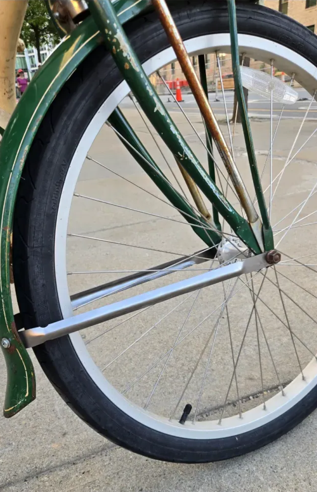

## Summary

For [Eyal Perry](https://www.perryeyal.com/bio-contact), I fixed a broken bike fender, a quick favor that should’ve taken five minutes and ended up demonstrating a surprisingly powerful closed-loop fabrication workflow. It was so clean and fast that xTool ended up featuring the project across their social media channels, e.g. [LinkedIn](https://www.linkedin.com/posts/xtooleducation_makereducation-metalfabrication-xtool-activity-7358163561589714945-1tH8/?utm_source=share&utm_medium=member_desktop&rcm=ACoAAApRK2sB_49ULhsgoEL14UP6FFAp7cJlKzs).

The fender’s support rails had snapped from corrosion, making welding pointless, too much material had vanished. So we grabbed the intact rail, dropped it onto the xTool MetalFab, and traced it directly using the live camera. The workflow demonstrated what essentially amounts to a photocopy of a 3D part on the spot. No CAD session, no prep, just a near-instant replacement.

It was meant to be a simple fix. Instead, it turned into a neat demonstration of what fabrication looks like when the capture → design → build loop collapses into a single, fluid gesture.

For a great write-up, see Eyal Perry’s Notion post below:

[Link to Notion](https://eperry.notion.site/Custom-Parts-for-an-Old-Bike-using-the-xTool-MetalFab-23dd2e30b48c800dad9df4b1f0fcb1c5)

<!--`youtube: Gp61NSQn5dA<`
-->

