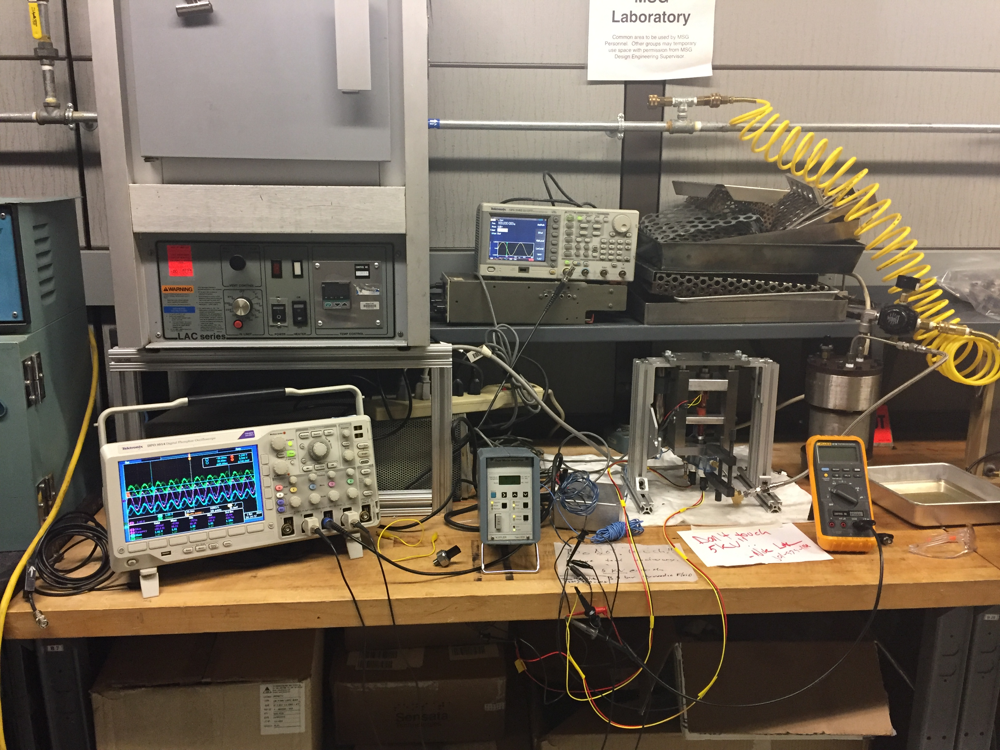
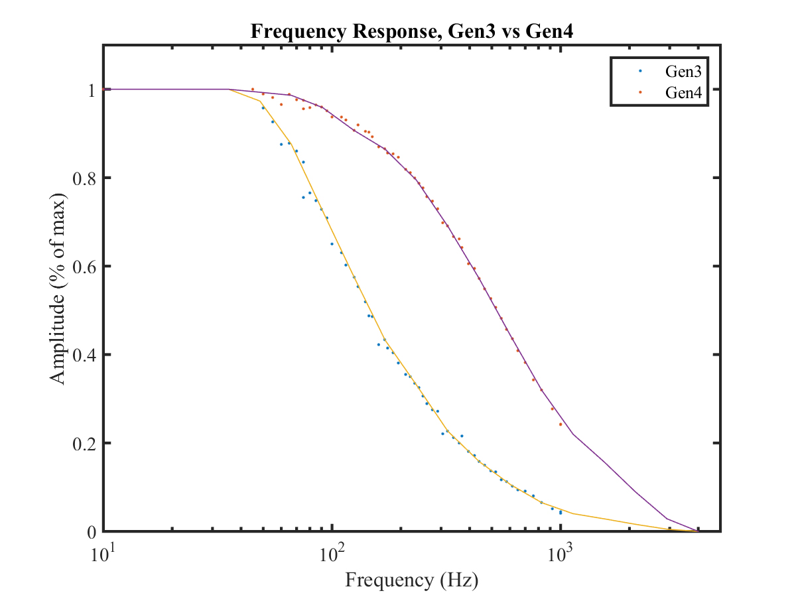

## Summary

## **High-Frequency Pressure Cycling System**
Sensata’s standard pressure-cycling operated at **<10 Hz**, making a 400-million-cycle qualification test a **462-day** effort that consumed **>\$500k** in testing resources. I developed a pressure cycler capable of **5 kHz**, reducing that same test to **under a day** and bringing the cost down to roughly the **\$10k NRE** for the setup. Scaled across the hundreds of pressure-sensor validations performed each year, the system represented **millions in potential savings**.

Using the same piezo actuator, I extended the platform to run **mechanical resonance and frequency-response analysis**, allowing Sensata to empirically determine true mechanical transfer functions for their sensors for the **first time** (see below).

<!--more-->

## Photos

*Fig. 1: Full system in use, visuals of the oscilloscopes, amplifier, electromechanical-fluidic system, and the key innovation of a fluid accumulator that would bleed small amounts of fluid into the system via a repurposed snubber to replenish fluid leaking out past the dynamic piston seal. The snubber served as a pressure barrier, so, despite cycling rapidly on the system side, it would create an artificial pressure wall due to the significant L/d ratio of the micro-orifice. See Pouiseuille's Law for more details.*

*Fig. 2: Close-up of the pressure cycler interface, a 120um displacement stack of ceramic piezoactuators was used to mechanically actuate a piston, displacement induced by 10kV amplitude sine wave. The piston would repeatedly compress a small volume of fluid which the pressure sensor under test and the Kistler reference pressure would simultaneously measure.*

*Fig. 3: Following the poster session, I spent time conducting additional testing to gather enough data to normalize the sensor outputs. Each dot on this plot represents a discrete sampling at a particular frequency. A Fast Fourier Transform is conducted on each subset of data at every frequency tested, and the aggregate of every transform is plotted here using a MATLAB script. The digital filtering (Low Pass Filter emulation) built into the ASIC of the Gen4 sensor dampens response compared to the Gen3 ASIC that does not have this feature.*

