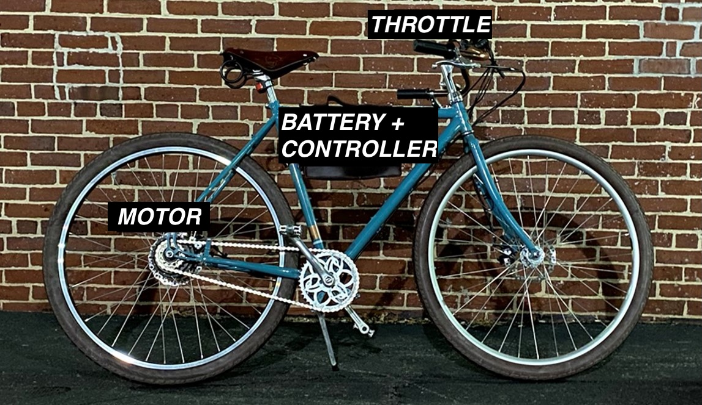
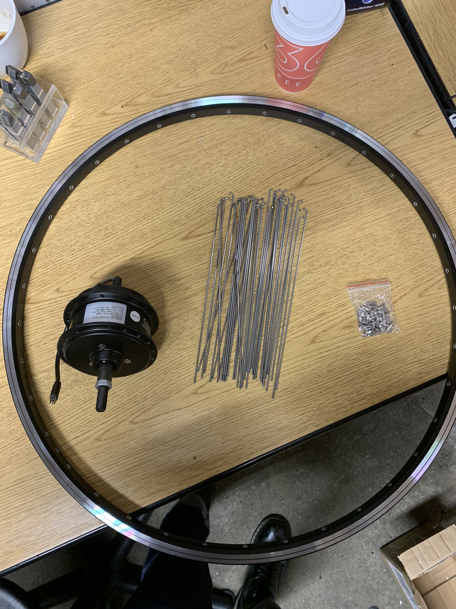
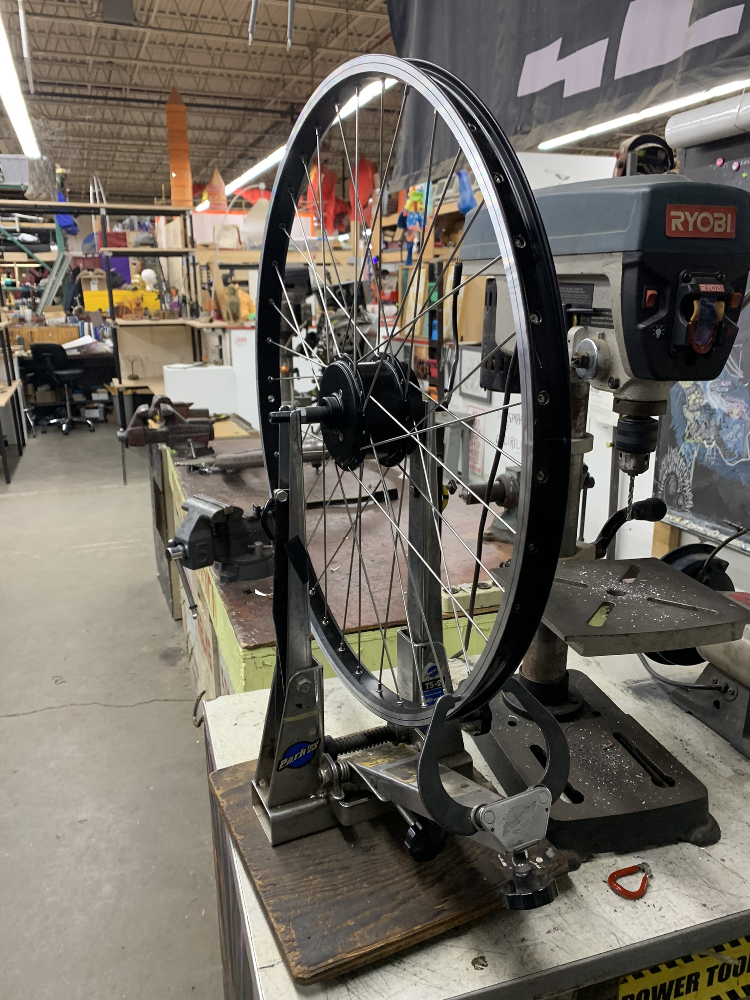
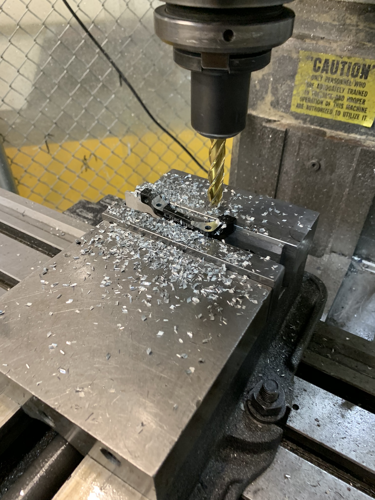
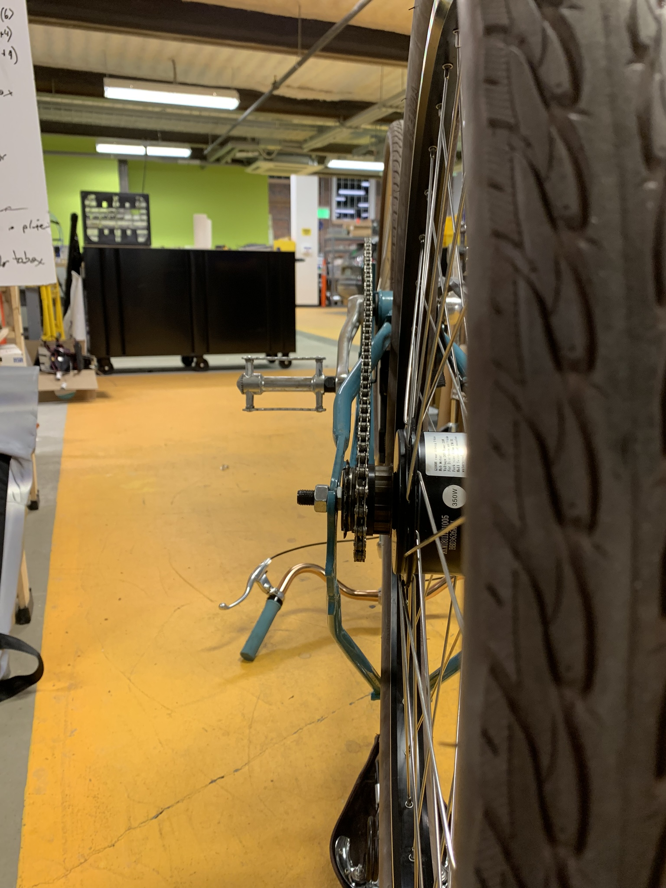
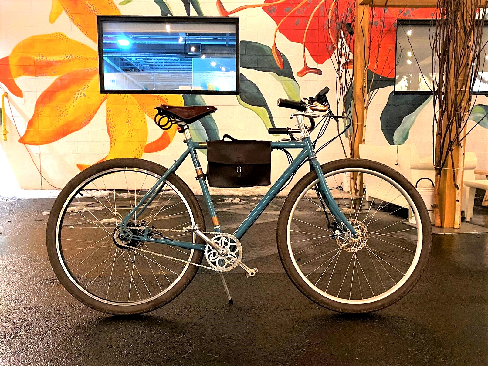

## Summary

A concealed, lightweight electric bicycle built around an unusually high 60 V system — a voltage more typical of e-motorcycles. Powered by a compact 16s1p LiPo pack and a modified Infineon controller with IRFB4110 MOSFETs, the bike briefly reached 1500 W before clutch slip and rider sanity set the limit; daily use is capped at 18 A to protect a motor rated for 10 A continuous. The stealth packaging, upright riding position, and silent acceleration created the uncanny impression of a normal bike moving uncomfortably fast through traffic.

`youtube: fR6uySCIAOo`

<!--more--> 

## Technical Specifications

Parameters | Value
------------ | ------------
Max Speed | 25MPH
Distance | 7mi
Acceleration | 0-25MPH, 10s with pedaling
Max Current | 18A
Max Voltage | 66V

## Photos

*Fig. 1: Custom wheel built to house the smallest hub motor available on the market, rated for 350w.*

*Fig. 2: Completed wheel on truing stand in the Skul space in Artisan's Asylum, double cross spoke pattern*

*Fig. 3: Machining disc brake caliper bracket as the hub was significantly wider than the original hub. Milling down bolt attach points enabled me to move the caliper 0.15" outwards from the center plane.*

*Fig. 4: Custom spacers were turned on the lathe to get proper chain alignment on a 7-speed freewheel hub that I converted to a single speed freewheel.*

*Fig. 5: Completed bicycle after test ride*
