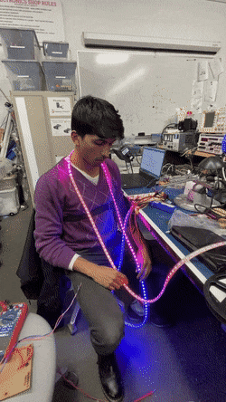
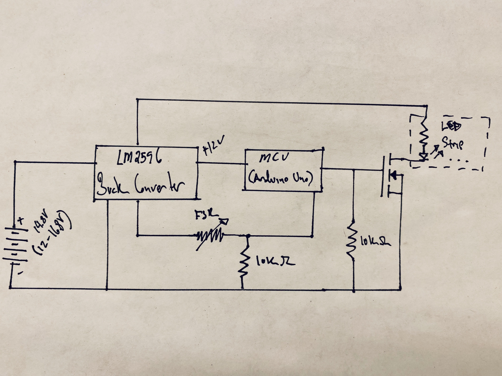
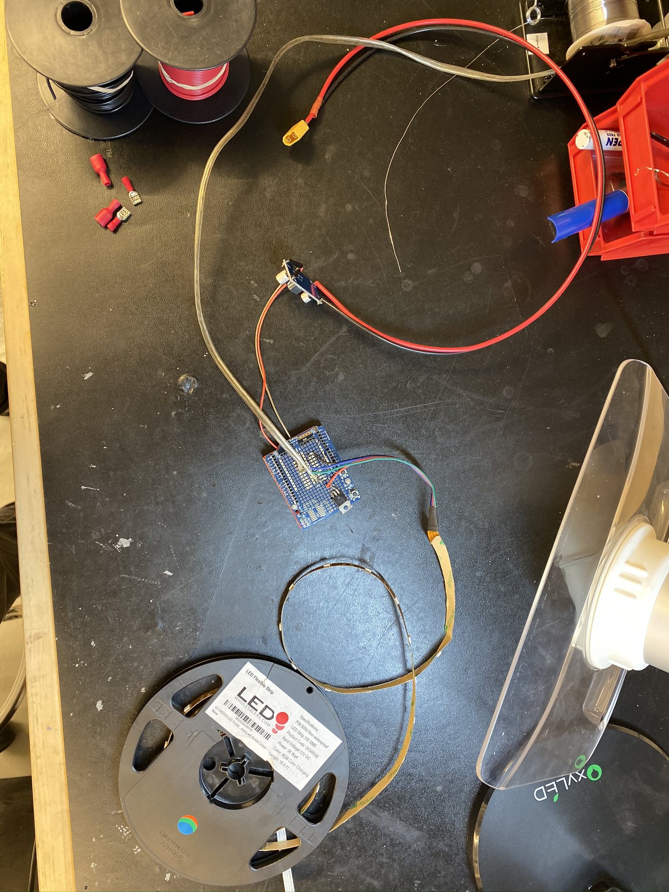
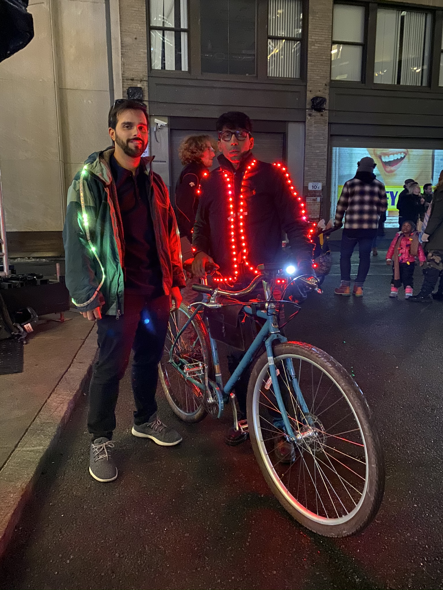

## Summary

Built overnight for a light festival, this jacket maps breathing to light intensity: inhalation brightens the LEDs, exhalation dims them. A force-sensing resistor strapped to my chest with an elastic belt captured the expansion and contraction in real time.
As a cyclist riding at night, the goal was to make my presence unmistakably human rather than just another point of light in traffic.

<!--more--> 

## Photos

*Fig. 1: Breathing in and out, early prototype using addressable LEDs and a Teensy 3.2 to control them*

*Fig. 2: Circuit design, did not include voltage cutoff for battery, really should have, BUT I used a 3Ah battery that had plenty of energy for the duration of the event.*

*Fig. 3: Completed circuit*

*Fig. 4: Jason Chrisos and I at the festival, pictured: [Electric Bike Project](https://niklal.me/ebike/)*
