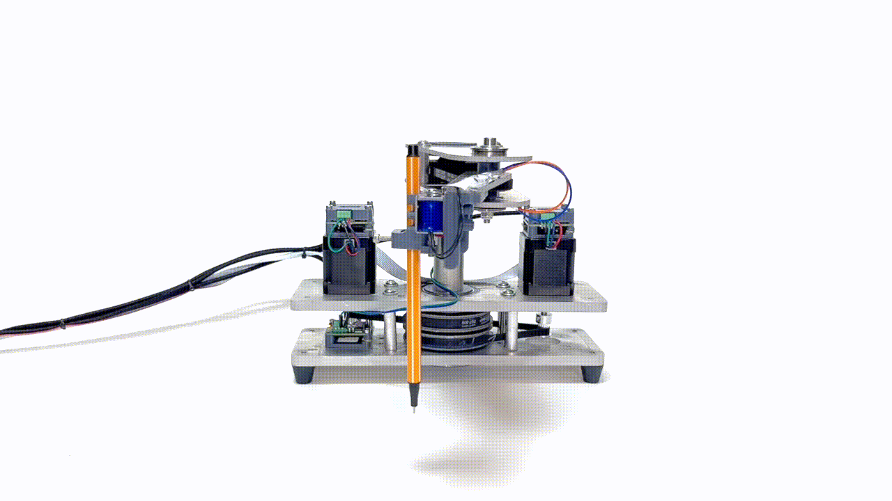

## Summary
In August 2024, Ilan Moyer, Leo McElroy, and Jake Read organized a weekend workshop focused on rapid machine construction. Over two days, I built a small robotic arm following a **SCARA-style architecture** with a **coaxial transmission** layout. Most of the structure came from scrap stock, assembled at speed, and the final mechanism worked far better than expected given the constraints.

[Link to OnShape Part Studio](https://cad.onshape.com/documents/34102a543ff30cdbd72fd4d1/w/a2868df37211d2859611a533/e/a5b05398c24a3d79c3f9fa60)

<!--`youtube: Gp61NSQn5dA<`
-->

