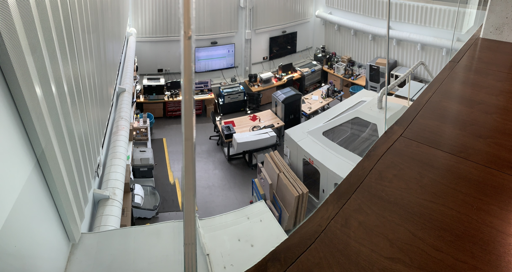
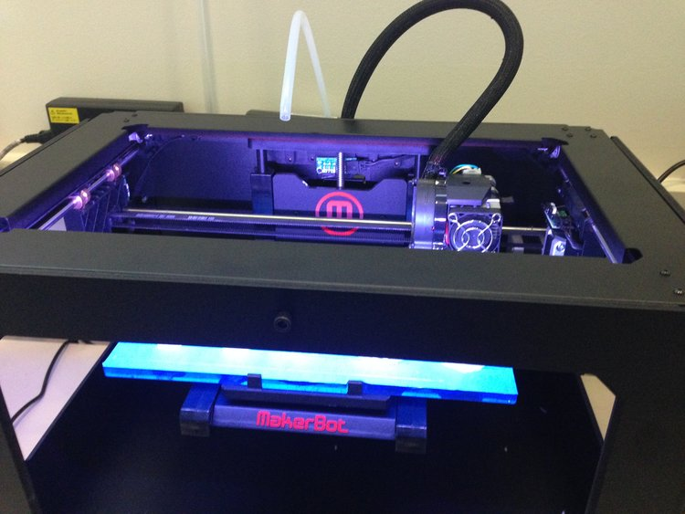

## Summary

### Co-Founding the Cornell Rapid Prototyping Lab (RPL)

I co-founded the Rapid Prototyping Lab (RPL) at Cornell to give the engineering community a place where class projects, project teams, and personal ideas could actually get built. A friend and I pulled together a small fleet of printers with support from Dr. Robert Shepherd and Matt Ulinski, moved everything into one room, and just started printing. What began as a handful of teams asking for help quickly turned into an exponential adoption curve as we increased uptime, tools, and support.

We built a student team, a scheduling system to coordinate jobs, and—most importantly—kept every machine running continuously. Before the RPL existed, Cornell’s printers were down half the time due to user error and maintenance issues. Fixing that single bottleneck unlocked a massive amount of productivity. Today the RPL operates out of a two-story space in the renovated Upson Hall and has grown far beyond the scrappy lab we started.

During the first year, our equipment lineup included 2 *Up! Plus 2* printers (FFF), 2 *CubeX Duo* printers (FFF), a *Stratasys Dimension* (FDM), 2 *MakerBot Replicators* (FDM), an *Objet 30* (polyjet), and an Epilog 50W laser cutter. The room itself was renovated around our needs to improve airflow, thermal stability, and safety.

I spent that year working closely with the student community—advising prototypes, debugging designs, and developing a deep appreciation for smart CAD workflows and well-run rapid prototyping operations. It was one of the foundations of how I approach fabrication work today.

[Link to RPL website](https://cornellrpl.wixsite.com/cornellrpl)

<!--more--> 

## Photos

*Fig. 1: One of the few photos I have from the original lab. The lab itself was only about 200sq. ft. and was hidden away in a dark corner of the engineering campus.*

## Videos

`youtube: baFAR68NuK0`

*UP printers going full steam after days of debug*
