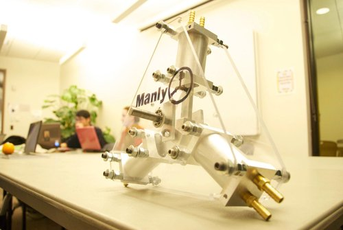
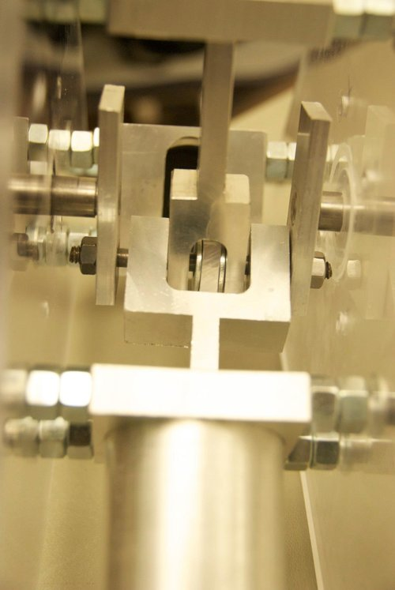
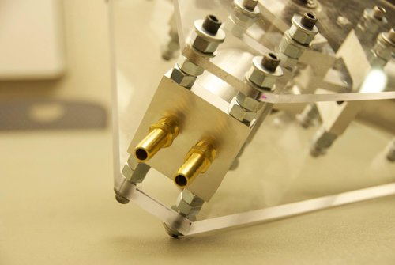

## Summary

### Windmill-Powered Water Pump (MAE 2250)

For our foundational mechanical design course (MAE 2250), our team was the only one to pursue a triaxial, single-acting piston architecture for the windmill-powered water pump competition. Most teams chose the more conventional inline, dual-acting dual-piston layout, but we wanted a geometry that delivered continuous and predictable load on the windmill.

The design worked: the triaxial arrangement provided a nearly constant back-torque on the rotor, giving the turbine smoother operation and higher rotational speeds than many intermittent-load designs. While our overall performance landed behind the best of the traditional dual-acting pumps, the mechanical behavior of our system was notably stable and efficient in its torque profile.

Looking back, there’s plenty I’d improve—straight taps into NPT threads, missing fasteners, loose tolerances, burrs everywhere—but the project remains one of the earliest moments where I started to think seriously about technical performance, manufacturability, and how elegant mechanical design often comes down to choosing the right constraints.

<!--more-->

## Photos

*Fig.1: Completed assembly*

*Fig. 2: Linkage converting rotary input to linear output, 2 links and 2 revolute joints. Very embarrassing.*

*Fig.3: Numerous nuts were used as spacers to save time rather than using a lathe to make them individually*
